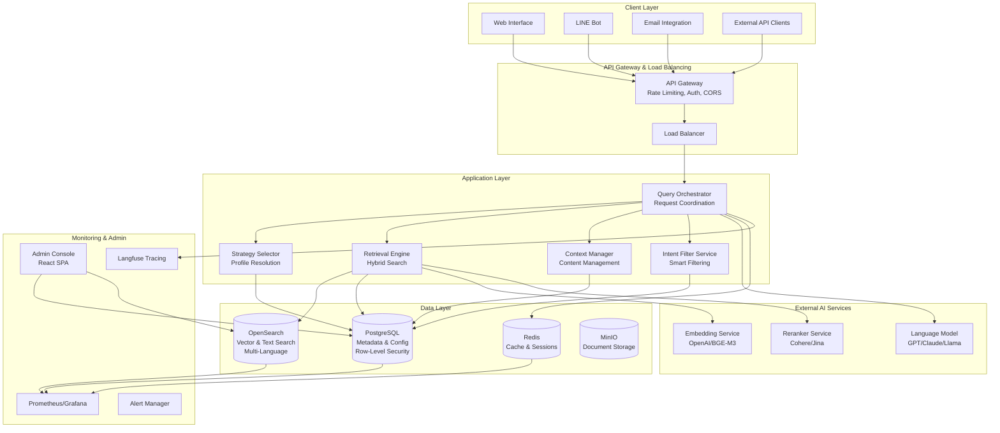
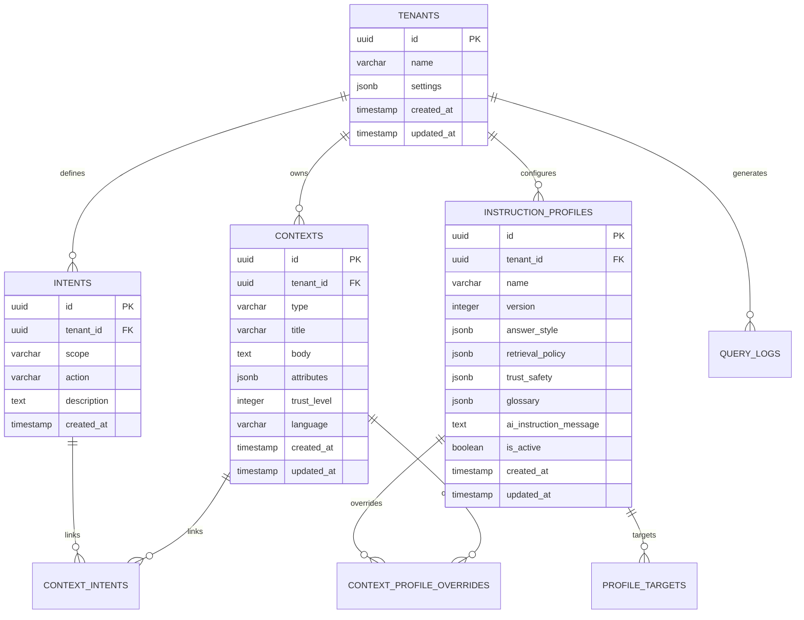

# Multi-Tenant RAG Assistant - Technical Architecture Specification

## Executive Summary

The Multi-Tenant RAG Assistant is a sophisticated retrieval-augmented generation system designed to serve multiple organizations (tenants) with complete data isolation while providing intelligent, context-aware responses through intent-driven query processing. The system combines modern microservices architecture with advanced AI/ML capabilities to deliver high-performance, scalable, and auditable conversational AI experiences.

## System Overview

### Core Value Proposition

The system addresses the challenge of providing personalized, accurate, and contextually relevant AI responses across multiple tenants by:

1. **Intent-Driven Architecture**: Classifies user queries into structured intents (scope/action/detail) to enable precise context retrieval
2. **Profile-Based Strategy Selection**: Uses configurable instruction profiles to control AI behavior and response characteristics
3. **Hybrid Retrieval Engine**: Combines structured fast-path queries with semantic search for optimal performance
4. **Complete Tenant Isolation**: Ensures data security and customization at the tenant level
5. **Full Auditability**: Provides comprehensive logging and tracing for compliance and optimization

### Key Technical Differentiators

- **Flexible Intent Filtering**: Supports partial intent matching (scope-only, action-only, or combined)
- **Multi-Language Support**: Handles content and queries in multiple languages with unified vector embeddings
- **Graceful Degradation**: Maintains functionality even when external services fail
- **Real-Time Configuration**: Allows instant profile updates without system restarts
- **Performance Optimization**: Achieves sub-1.5s response times for complex RAG queries

## Architecture Overview

### High-Level System Architecture



### Technology Stack

#### Backend Services
- **Runtime**: Node.js 18+ with TypeScript
- **Framework**: Express.js with dependency injection (InversifyJS)
- **API Design**: RESTful APIs with OpenAPI 3.0 specification
- **Validation**: Zod schemas for runtime type safety
- **Testing**: Vitest for unit/integration testing

#### Data Storage
- **Primary Database**: PostgreSQL 15+ with row-level security
- **Search Engine**: OpenSearch 2.x for vector and text search
- **Cache**: Redis 7.x for session management and performance optimization
- **Object Storage**: MinIO for document and media storage

#### Frontend
- **Framework**: React 18 with TypeScript
- **Build Tool**: Vite for fast development and optimized builds
- **UI Components**: Custom components with modern CSS
- **State Management**: React hooks and context API

#### Infrastructure
- **Containerization**: Docker and Docker Compose
- **Orchestration**: Kubernetes (production deployment)
- **Monitoring**: Prometheus, Grafana, and Langfuse
- **CI/CD**: GitHub Actions with automated testing and deployment

## Core Components Deep Dive

### 1. Query Orchestrator

**Purpose**: Central coordinator that manages the complete request lifecycle from initial query to final response.

**Key Responsibilities**:
- Request preprocessing (language detection, tenant validation, conversation context)
- Service coordination and error handling
- Response post-processing and formatting
- Audit logging and metrics collection
- Circuit breaker implementation for external services

**Technical Implementation**:
```typescript
interface QueryOrchestrator {
  processQuery(request: ContextRetrievalRequest): Promise<ContextRetrievalResponse>;
  preprocessRequest(request: any): Promise<PreprocessedRequest>;
  postprocessResponse(response: any, request: any): Promise<any>;
}

interface PreprocessedRequest {
  original_request: ContextRetrievalRequest;
  detected_language: string;
  tenant_context: TenantContext;
  processing_start_time: number;
}
```

**Performance Characteristics**:
- Request preprocessing: < 50ms p95
- Service coordination overhead: < 100ms p95
- Error handling with graceful degradation
- Automatic retry logic with exponential backoff

### 2. Intent Filter Service

**Purpose**: Provides flexible intent-based context filtering with support for partial intent matching and query enhancement.

**Key Features**:
- **Flexible Filtering**: Supports scope-only, action-only, or combined filtering
- **Query Enhancement**: Combines original query with intent detail for better semantic search
- **Fallback Mechanisms**: Falls back to text search when intent filtering fails
- **Performance Analytics**: Tracks filtering effectiveness and provides recommendations

**Technical Implementation**:
```typescript
interface IntentFilterService {
  filterContextsByIntent(
    tenantId: string,
    query: string,
    intentFilters: EnhancedIntentFilters,
    options: IntentFilteringOptions
  ): Promise<IntentFilteringResult>;
  
  getFilteringRecommendations(
    tenantId: string,
    query: string
  ): Promise<FilteringRecommendations>;
}

interface EnhancedIntentFilters {
  scope?: string;    // Optional - filter by intent scope
  action?: string;   // Optional - filter by intent action
  detail?: string;   // Optional - enhance query with additional context
}
```

**Filtering Strategies**:
1. **Scope-Only**: Filter contexts linked to specific intent scope
2. **Action-Only**: Filter contexts linked to specific intent action
3. **Scope-and-Action**: Filter contexts linked to both scope and action
4. **Text-Only**: Fall back to pure text search
5. **Combined**: Enhanced query with intent detail integration

### 3. Strategy Selector

**Purpose**: Determines the most appropriate instruction profile based on intent, channel, user segment, and other contextual factors.

**Profile Resolution Algorithm**:
1. **Target Matching**: Find all profile targets matching request context
2. **Priority Sorting**: Sort matches by priority (higher numbers win)
3. **Specificity Ranking**: Prefer more specific matches (more criteria matched)
4. **Override Application**: Apply context-specific overrides if present

**Technical Implementation**:
```typescript
interface StrategySelector {
  selectProfile(
    tenantId: string,
    intent: Intent,
    channel?: string,
    userSegment?: string
  ): Promise<InstructionProfile>;
  
  applyOverrides(
    profile: InstructionProfile,
    contextIds: string[]
  ): Promise<InstructionProfile>;
}

interface ProfileTarget {
  profile_id: string;
  tenant_id: string;
  intent_scope?: string;
  intent_action?: string;
  channel?: string;
  user_segment?: string;
  priority: number;
}
```

### 4. Retrieval Engine

**Purpose**: Executes hybrid search combining structured fast-path queries with semantic vector search.

**Search Strategies**:

1. **Structured Fast-Path**: Direct database queries for structured data
   - Store location searches with geo-radius filtering
   - Ticket lookups by ID or event
   - FAQ exact matches
   - Performance target: < 400ms p95

2. **Hybrid Semantic Search**: BM25 + vector similarity
   - Multi-language vector embeddings (1536 dimensions)
   - BM25 text matching with language-specific analyzers
   - Score fusion and reranking
   - Performance target: < 1.5s p95

3. **Trust-Level Filtering**: Post-retrieval filtering based on profile settings
   - Minimum trust level enforcement
   - PII redaction when enabled
   - Citation requirement validation

**Technical Implementation**:
```typescript
interface RetrievalEngine {
  executeStructuredSearch(
    tenantId: string,
    query: string,
    type: ContextType,
    filters: StructuredFilters
  ): Promise<Context[]>;
  
  executeHybridSearch(
    tenantId: string,
    query: string,
    intentFilters: IntentFilters,
    profile: InstructionProfile
  ): Promise<RetrievalResult>;
  
  applyTrustFiltering(
    contexts: Context[],
    profile: InstructionProfile
  ): Context[];
}
```

### 5. Context Manager

**Purpose**: Manages the storage, indexing, and retrieval of diverse knowledge sources with multi-language support.

**Context Types Supported**:
- **Place**: Physical locations with geo-coordinates, addresses, hours
- **Website**: Web pages with URL, domain, content, last crawled timestamp
- **Ticket**: Event tickets with pricing, availability, event details
- **Doc Chunk**: Document fragments with source URI, page numbers, headings

**Multi-Language Support**:
- Language-agnostic vector embeddings
- Language-specific text analyzers for BM25
- Automatic language detection and metadata storage
- Cross-language semantic search capabilities

**Technical Implementation**:
```typescript
interface Context {
  id: string;
  tenant_id: string;
  type: 'place' | 'website' | 'ticket' | 'doc_chunk';
  title: string;
  body: string;
  attributes: Record<string, any>; // Type-specific flexible attributes
  trust_level: number;
  language?: string;
  created_at: Date;
  updated_at: Date;
}

// Type-specific attribute examples:
interface PlaceAttributes {
  lat: number;
  lon: number;
  address: string;
  phone?: string;
  hours?: Record<string, string>;
}

interface WebsiteAttributes {
  url: string;
  domain: string;
  last_crawled: Date;
  status_code?: number;
}
```

## Data Architecture

### Database Schema Design

#### Core Entity Relationships



#### Row-Level Security Implementation

PostgreSQL row-level security ensures complete tenant isolation:

```sql
-- Enable RLS on all tenant-scoped tables
ALTER TABLE contexts ENABLE ROW LEVEL SECURITY;
ALTER TABLE intents ENABLE ROW LEVEL SECURITY;
ALTER TABLE instruction_profiles ENABLE ROW LEVEL SECURITY;
ALTER TABLE query_logs ENABLE ROW LEVEL SECURITY;

-- Create policies for tenant isolation
CREATE POLICY tenant_isolation_contexts ON contexts
    FOR ALL TO application_role
    USING (tenant_id = current_setting('app.current_tenant_id')::uuid);

CREATE POLICY tenant_isolation_intents ON intents
    FOR ALL TO application_role
    USING (tenant_id = current_setting('app.current_tenant_id')::uuid);
```

### OpenSearch Index Architecture

#### Context Search Index

```json
{
  "settings": {
    "number_of_shards": 3,
    "number_of_replicas": 1,
    "analysis": {
      "analyzer": {
        "multilingual": {
          "type": "standard",
          "stopwords": "_none_"
        }
      }
    }
  },
  "mappings": {
    "properties": {
      "tenant_id": {"type": "keyword"},
      "context_id": {"type": "keyword"},
      "type": {"type": "keyword"},
      "title": {
        "type": "text",
        "analyzer": "multilingual",
        "fields": {"keyword": {"type": "keyword"}}
      },
      "body": {
        "type": "text",
        "analyzer": "multilingual"
      },
      "embedding": {
        "type": "knn_vector",
        "dimension": 1536,
        "method": {
          "name": "hnsw",
          "space_type": "cosinesimil",
          "engine": "lucene"
        }
      },
      "intent_scopes": {"type": "keyword"},
      "intent_actions": {"type": "keyword"},
      "trust_level": {"type": "integer"},
      "language": {"type": "keyword"},
      "attributes": {"type": "object", "dynamic": true}
    }
  }
}
```

## API Architecture

### RESTful API Design

#### Core Context Retrieval API

```typescript
// POST /api/retrieve
interface ContextRetrievalRequest {
  query: string;
  intent?: {
    scope?: string;    // Optional - filter by intent scope
    action?: string;   // Optional - filter by intent action
    detail?: string;   // Optional - enhance query with additional context
  };
  tenant_id: string;
  channel?: string;
  user_id?: string;
  conversation_history?: ConversationTurn[];
}

interface ContextRetrievalResponse {
  contexts: Context[];
  citations: Citation[];
  profile_id: string;
  ai_instruction_message: string;
  retrieval_method: 'structured' | 'hybrid' | 'fallback';
  latency_ms: number;
  intent_filters_applied: {
    scope_filter: boolean;
    action_filter: boolean;
    combined_query: string;
  };
}
```

#### Admin Management APIs

```typescript
// Context Management
GET    /api/admin/contexts              // List contexts with filtering
POST   /api/admin/contexts              // Create new context
GET    /api/admin/contexts/:id          // Get context details
PUT    /api/admin/contexts/:id          // Update context
DELETE /api/admin/contexts/:id          // Delete context
POST   /api/admin/contexts/bulk-import  // Bulk import contexts
GET    /api/admin/contexts/bulk-export  // Bulk export contexts

// Intent Management
GET    /api/admin/intents               // List intents
POST   /api/admin/intents               // Create intent
PUT    /api/admin/intents/:id           // Update intent
DELETE /api/admin/intents/:id           // Delete intent
POST   /api/admin/intents/merge         // Merge multiple intents
GET    /api/admin/intents/:id/stats     // Get intent usage statistics

// Profile Management
GET    /api/admin/profiles              // List instruction profiles
POST   /api/admin/profiles              // Create profile
PUT    /api/admin/profiles/:id          // Update profile
DELETE /api/admin/profiles/:id          // Delete profile
```

### Error Handling Strategy

#### Standardized Error Response Format

```typescript
interface ErrorResponse {
  error_code: string;
  message: string;
  details?: Record<string, any>;
  fallback_answer?: string;
  suggested_actions?: string[];
  escalation_required: boolean;
  timestamp: string;
  request_id: string;
}
```

#### Error Categories and Handling

1. **Validation Errors** (400)
   - Missing required fields
   - Invalid data formats
   - Schema validation failures

2. **Authentication/Authorization Errors** (401/403)
   - Missing tenant ID
   - Invalid API keys
   - Insufficient permissions

3. **Resource Not Found** (404)
   - Context not found
   - Intent not found
   - Profile not found

4. **Business Logic Errors** (409)
   - Duplicate intent scope/action
   - Profile target conflicts
   - Circular dependencies

5. **External Service Errors** (502/503)
   - Embedding service unavailable
   - Search engine timeout
   - Database connection failure

6. **Internal Server Errors** (500)
   - Unexpected exceptions
   - System resource exhaustion
   - Configuration errors

## Performance Architecture

### Performance Requirements and SLAs

| Operation Type | Target Latency (p95) | Target Throughput |
|---|---|---|
| Structured Fast-Path | < 400ms | 1000 req/s |
| Hybrid RAG Pipeline | < 1.5s | 500 req/s |
| Admin Operations | < 1s | 100 req/s |
| Database Queries | < 100ms | 2000 req/s |
| Cache Operations | < 10ms | 5000 req/s |

### Caching Strategy

#### Multi-Level Caching Architecture

1. **Application-Level Cache** (Redis)
   - Query result caching (TTL: 5 minutes)
   - Profile resolution caching (TTL: 1 hour)
   - Intent-context mapping cache (TTL: 30 minutes)
   - Embedding cache for frequent queries (TTL: 24 hours)

2. **Database Query Cache** (PostgreSQL)
   - Prepared statement caching
   - Query plan caching
   - Connection pooling (10-50 connections per service)

3. **Search Index Cache** (OpenSearch)
   - Filter cache for frequent intent filters
   - Field data cache for aggregations
   - Request cache for identical queries

#### Cache Invalidation Strategy

```typescript
interface CacheInvalidationService {
  invalidateProfileCache(tenantId: string, profileId: string): Promise<void>;
  invalidateIntentCache(tenantId: string, intentId: string): Promise<void>;
  invalidateContextCache(tenantId: string, contextId: string): Promise<void>;
  invalidateQueryCache(cacheKey: string): Promise<void>;
}
```

### Load Balancing and Scaling

#### Horizontal Scaling Strategy

1. **Stateless Service Design**: All services are stateless and can be scaled horizontally
2. **Database Read Replicas**: Read-heavy operations use dedicated read replicas
3. **Search Cluster Scaling**: OpenSearch cluster can be scaled based on index size and query load
4. **Cache Cluster**: Redis cluster with sharding for high availability

#### Auto-Scaling Configuration

```yaml
# Kubernetes HPA configuration
apiVersion: autoscaling/v2
kind: HorizontalPodAutoscaler
metadata:
  name: rag-assistant-hpa
spec:
  scaleTargetRef:
    apiVersion: apps/v1
    kind: Deployment
    name: rag-assistant
  minReplicas: 3
  maxReplicas: 20
  metrics:
  - type: Resource
    resource:
      name: cpu
      target:
        type: Utilization
        averageUtilization: 70
  - type: Resource
    resource:
      name: memory
      target:
        type: Utilization
        averageUtilization: 80
```

## Security Architecture

### Multi-Tenant Security Model

#### Tenant Isolation Mechanisms

1. **Database Level**: Row-level security policies ensure complete data isolation
2. **Application Level**: Tenant context validation on every request
3. **API Level**: Tenant ID validation in headers and request bodies
4. **Cache Level**: Tenant-scoped cache keys prevent cross-tenant data leakage

#### Authentication and Authorization

```typescript
interface SecurityMiddleware {
  validateTenantAccess(tenantId: string, apiKey: string): Promise<boolean>;
  enforceRateLimit(tenantId: string, endpoint: string): Promise<boolean>;
  auditRequest(request: Request, response: Response): Promise<void>;
}

interface TenantContext {
  tenant_id: string;
  tenant: Tenant;
  settings: TenantSettings;
  active_features: string[];
  rate_limits: RateLimitConfig;
}
```

#### Data Protection and Privacy

1. **PII Redaction**: Configurable per profile with regex-based detection
2. **Encryption**: All data encrypted at rest and in transit
3. **Audit Logging**: Complete audit trail for all data access and modifications
4. **Data Retention**: Configurable retention policies per tenant

### API Security

#### Rate Limiting Strategy

```typescript
interface RateLimitConfig {
  requests_per_minute: number;
  burst_limit: number;
  concurrent_requests: number;
  daily_quota?: number;
}

// Example rate limits by endpoint
const RATE_LIMITS = {
  '/api/retrieve': { requests_per_minute: 100, burst_limit: 20 },
  '/api/admin/*': { requests_per_minute: 60, burst_limit: 10 },
  '/api/admin/contexts/bulk-import': { requests_per_minute: 5, burst_limit: 2 }
};
```

#### Input Validation and Sanitization

```typescript
// Zod schemas for runtime validation
const ContextRetrievalRequestSchema = z.object({
  query: z.string().min(1).max(1000),
  intent: z.object({
    scope: z.string().optional(),
    action: z.string().optional(),
    detail: z.string().max(500).optional()
  }).optional(),
  tenant_id: z.string().uuid(),
  channel: z.string().optional(),
  user_id: z.string().optional()
});
```

## Monitoring and Observability

### Comprehensive Monitoring Stack

#### Application Performance Monitoring

1. **Request Tracing**: Distributed tracing with Langfuse
2. **Performance Metrics**: Response times, throughput, error rates
3. **Business Metrics**: Query success rates, intent classification accuracy
4. **Resource Monitoring**: CPU, memory, disk, network utilization

#### Key Performance Indicators (KPIs)

```typescript
interface SystemMetrics {
  // Performance KPIs
  avg_response_time_ms: number;
  p95_response_time_ms: number;
  requests_per_second: number;
  error_rate_percentage: number;
  
  // Business KPIs
  zero_hit_rate: number;
  avg_confidence_score: number;
  citation_compliance_rate: number;
  intent_classification_accuracy: number;
  
  // System Health KPIs
  database_connection_pool_usage: number;
  cache_hit_rate: number;
  search_index_health: string;
  external_service_availability: Record<string, number>;
}
```

#### Alerting Strategy

```yaml
# Prometheus alerting rules
groups:
- name: rag-assistant-alerts
  rules:
  - alert: HighErrorRate
    expr: rate(http_requests_total{status=~"5.."}[5m]) > 0.1
    for: 2m
    labels:
      severity: critical
    annotations:
      summary: "High error rate detected"
      
  - alert: SlowResponseTime
    expr: histogram_quantile(0.95, rate(http_request_duration_seconds_bucket[5m])) > 2.0
    for: 5m
    labels:
      severity: warning
    annotations:
      summary: "Response time degradation"
      
  - alert: LowCacheHitRate
    expr: redis_cache_hit_rate < 0.8
    for: 10m
    labels:
      severity: warning
    annotations:
      summary: "Cache performance degradation"
```

### Logging Architecture

#### Structured Logging Format

```typescript
interface LogEntry {
  timestamp: string;
  level: 'debug' | 'info' | 'warn' | 'error';
  service: string;
  tenant_id?: string;
  request_id: string;
  user_id?: string;
  message: string;
  metadata: Record<string, any>;
  duration_ms?: number;
  error?: {
    name: string;
    message: string;
    stack: string;
  };
}
```

#### Log Aggregation and Analysis

1. **Centralized Logging**: All services log to centralized system (ELK stack)
2. **Log Correlation**: Request IDs for tracing across services
3. **Automated Analysis**: Pattern detection for anomalies and errors
4. **Retention Policies**: Different retention periods based on log level and tenant requirements

## Deployment Architecture

### Container-Based Deployment

#### Docker Configuration

```dockerfile
# Multi-stage build for optimized production image
FROM node:18-alpine AS builder
WORKDIR /app
COPY package*.json ./
RUN npm ci --only=production

FROM node:18-alpine AS runtime
WORKDIR /app
COPY --from=builder /app/node_modules ./node_modules
COPY dist ./dist
COPY package.json ./
EXPOSE 3000
CMD ["node", "dist/index.js"]
```

#### Docker Compose for Development

```yaml
version: '3.8'
services:
  app:
    build: .
    ports:
      - "3000:3000"
    environment:
      - NODE_ENV=development
      - DB_HOST=postgres
      - REDIS_HOST=redis
      - OPENSEARCH_HOST=opensearch
    depends_on:
      - postgres
      - redis
      - opensearch
      
  postgres:
    image: postgres:15-alpine
    environment:
      POSTGRES_DB: rag_assistant
      POSTGRES_USER: postgres
      POSTGRES_PASSWORD: password
    volumes:
      - postgres_data:/var/lib/postgresql/data
      
  redis:
    image: redis:7-alpine
    volumes:
      - redis_data:/data
      
  opensearch:
    image: opensearchproject/opensearch:2.11.0
    environment:
      - discovery.type=single-node
      - DISABLE_SECURITY_PLUGIN=true
    volumes:
      - opensearch_data:/usr/share/opensearch/data
```

### Production Deployment (Kubernetes)

#### Service Deployment Configuration

```yaml
apiVersion: apps/v1
kind: Deployment
metadata:
  name: rag-assistant
spec:
  replicas: 3
  selector:
    matchLabels:
      app: rag-assistant
  template:
    metadata:
      labels:
        app: rag-assistant
    spec:
      containers:
      - name: rag-assistant
        image: rag-assistant:latest
        ports:
        - containerPort: 3000
        env:
        - name: NODE_ENV
          value: "production"
        - name: DB_HOST
          valueFrom:
            secretKeyRef:
              name: db-secret
              key: host
        resources:
          requests:
            memory: "512Mi"
            cpu: "250m"
          limits:
            memory: "1Gi"
            cpu: "500m"
        livenessProbe:
          httpGet:
            path: /health
            port: 3000
          initialDelaySeconds: 30
          periodSeconds: 10
        readinessProbe:
          httpGet:
            path: /health
            port: 3000
          initialDelaySeconds: 5
          periodSeconds: 5
```

### CI/CD Pipeline

#### GitHub Actions Workflow

```yaml
name: CI/CD Pipeline
on:
  push:
    branches: [main, develop]
  pull_request:
    branches: [main]

jobs:
  test:
    runs-on: ubuntu-latest
    steps:
    - uses: actions/checkout@v3
    - uses: actions/setup-node@v3
      with:
        node-version: '18'
        cache: 'npm'
    - run: npm ci
    - run: npm run type-check
    - run: npm run lint
    - run: npm test
    - run: npm run admin:test
    
  build:
    needs: test
    runs-on: ubuntu-latest
    if: github.ref == 'refs/heads/main'
    steps:
    - uses: actions/checkout@v3
    - name: Build Docker image
      run: docker build -t rag-assistant:${{ github.sha }} .
    - name: Push to registry
      run: |
        echo ${{ secrets.DOCKER_PASSWORD }} | docker login -u ${{ secrets.DOCKER_USERNAME }} --password-stdin
        docker push rag-assistant:${{ github.sha }}
        
  deploy:
    needs: build
    runs-on: ubuntu-latest
    if: github.ref == 'refs/heads/main'
    steps:
    - name: Deploy to production
      run: |
        kubectl set image deployment/rag-assistant rag-assistant=rag-assistant:${{ github.sha }}
        kubectl rollout status deployment/rag-assistant
```

## Testing Strategy

### Comprehensive Testing Approach

#### Test Pyramid Structure

1. **Unit Tests** (70% of tests)
   - Service layer business logic
   - Model validation and transformations
   - Utility functions and helpers
   - Mock external dependencies

2. **Integration Tests** (20% of tests)
   - API endpoint testing
   - Database integration
   - Cache integration
   - Service-to-service communication

3. **End-to-End Tests** (10% of tests)
   - Complete user workflows
   - Multi-tenant isolation verification
   - Performance regression testing
   - Admin console functionality

#### Test Implementation Examples

```typescript
// Unit test example
describe('IntentFilterService', () => {
  it('should filter contexts by scope only', async () => {
    const mockRepository = createMockContextRepository();
    const service = new IntentFilterService(mockRepository);
    
    const result = await service.filterContextsByIntent(
      'tenant-123',
      'find restaurants',
      { scope: 'dining' }
    );
    
    expect(result.filtering_strategy).toBe('scope_only');
    expect(result.contexts).toHaveLength(3);
    expect(mockRepository.searchWithIntentFiltering).toHaveBeenCalledWith(
      'tenant-123',
      'find restaurants',
      { scope: 'dining' },
      expect.any(Object)
    );
  });
});

// Integration test example
describe('Context Retrieval API', () => {
  it('should retrieve contexts with intent filtering', async () => {
    const response = await request(app)
      .post('/api/retrieve')
      .send({
        query: 'find Italian restaurants',
        intent: { scope: 'dining', action: 'find_location' },
        tenant_id: 'test-tenant-123'
      })
      .expect(200);
      
    expect(response.body).toHaveProperty('contexts');
    expect(response.body).toHaveProperty('profile_id');
    expect(response.body.intent_filters_applied.scope_filter).toBe(true);
    expect(response.body.intent_filters_applied.action_filter).toBe(true);
  });
});
```

#### Performance Testing

```typescript
// Performance test example
describe('Performance Tests', () => {
  it('should meet SLA for hybrid search', async () => {
    const startTime = Date.now();
    
    const response = await request(app)
      .post('/api/retrieve')
      .send({
        query: 'complex query requiring semantic search',
        tenant_id: 'test-tenant-123'
      });
      
    const duration = Date.now() - startTime;
    
    expect(response.status).toBe(200);
    expect(duration).toBeLessThan(1500); // 1.5s SLA
    expect(response.body.latency_ms).toBeLessThan(1500);
  });
});
```

### Quality Assurance

#### Automated Quality Gates

1. **Code Quality**: ESLint, Prettier, TypeScript strict mode
2. **Test Coverage**: Minimum 80% code coverage requirement
3. **Performance**: Automated performance regression testing
4. **Security**: Dependency vulnerability scanning
5. **Documentation**: API documentation generation and validation

#### Continuous Quality Monitoring

```typescript
// Quality metrics collection
interface QualityMetrics {
  test_coverage_percentage: number;
  code_complexity_score: number;
  technical_debt_hours: number;
  security_vulnerabilities: number;
  documentation_coverage: number;
  performance_regression_count: number;
}
```

## Future Architecture Considerations

### Scalability Roadmap

1. **Microservices Evolution**: Further decomposition of services for independent scaling
2. **Event-Driven Architecture**: Implement event sourcing for better auditability and scalability
3. **Multi-Region Deployment**: Geographic distribution for global performance
4. **AI/ML Pipeline Integration**: Real-time model training and deployment

### Technology Evolution

1. **Vector Database Migration**: Consider specialized vector databases (Pinecone, Weaviate)
2. **GraphQL API**: Implement GraphQL for more flexible client queries
3. **Serverless Functions**: Move to serverless for better cost optimization
4. **Edge Computing**: Deploy edge nodes for reduced latency

### Advanced Features

1. **Real-Time Analytics**: Stream processing for real-time insights
2. **A/B Testing Framework**: Built-in experimentation platform
3. **Advanced AI Features**: Integration with latest LLM capabilities
4. **Federated Learning**: Privacy-preserving model improvements

## Conclusion

The Multi-Tenant RAG Assistant represents a sophisticated, production-ready system that combines modern software architecture principles with advanced AI capabilities. The system is designed for:

- **High Performance**: Sub-1.5s response times for complex queries
- **Complete Scalability**: Horizontal scaling across all components
- **Enterprise Security**: Multi-tenant isolation with comprehensive audit trails
- **Operational Excellence**: Comprehensive monitoring, alerting, and automated deployment
- **Developer Experience**: Type-safe APIs, comprehensive testing, and clear documentation

This technical specification provides the foundation for understanding, extending, and maintaining the system while ensuring it meets the demanding requirements of modern enterprise AI applications.